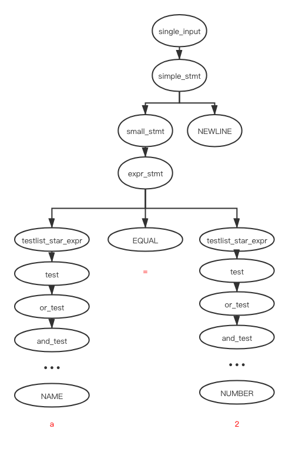
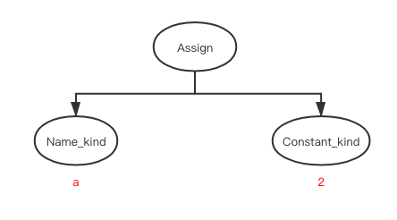

# CST TO AST

# 目录

* [相关位置文件](#相关位置文件)
* [pythonrun](#pythonrun)
* [CST 到 AST](#CST-到-AST)
* [更多资料](#更多资料)

# 相关位置文件

* Python/ast.c

* Python/pythonrun.c

* Include/Python-ast.h

* Python/Python-ast.c

* Python/asdl.c

* Include/asdl.h

  

下面的命令会从 `Parser/Python.asdl` 中生成 `Include/Python-ast.h` 和 `Python/Python-ast.c`, 这两个自动生成的文件的结构体会被用来从之前的  [语法树](https://github.com/zpoint/CPython-Internals/blob/master/Interpreter/compile/compile_cn.md#parse) 中生成 `AST`

```shell
% make regen-ast
# Regenerate Include/Python-ast.h using Parser/asdl_c.py -h
./install-sh -c -d ./Include
python3 ./Parser/asdl_c.py \
                -h ./Include/Python-ast.h.new \
                ./Parser/Python.asdl
python3 ./Tools/scripts/update_file.py ./Include/Python-ast.h ./Include/Python-ast.h.new
# Regenerate Python/Python-ast.c using Parser/asdl_c.py -c
./install-sh -c -d ./Python
python3 ./Parser/asdl_c.py \
                -c ./Python/Python-ast.c.new \
                ./Parser/Python.asdl
python3 ./Tools/scripts/update_file.py ./Python/Python-ast.c ./Python/Python-ast.c.new

```

> * 小写名称是 non-terminals.
> * 大写名称是 terminals
> * 文本 tokens 用双引号引起来
> * `[]` 表示 >= 0 个
> * `{}` 表示 >= 1 个
> * `?` 表示可能有可能没有, `*` 表示 >= 0 个

# pythonrun

我们以交互式循环为例, 展开 `pythonrun` 的调用栈看看


# CST 到 AST

我们把关注点放到 `PyAST_FromNodeObject` 上

如果我们执行

```python3
a = 2
```

这是上述语句生成的 CST 结构

```shell
n_type: 256, n_type_str: single_input, n_str: (null), n_children: 1
  n_type: 270, n_type_str: simple_stmt, n_str: (null), n_children: 2
    n_type: 271, n_type_str: small_stmt, n_str: (null), n_children: 1
      n_type: 272, n_type_str: expr_stmt, n_str: (null), n_children: 3
        n_type: 274, n_type_str: testlist_star_expr, n_str: (null), n_children: 1
          n_type: 305, n_type_str: test, n_str: (null), n_children: 1
            n_type: 309, n_type_str: or_test, n_str: (null), n_children: 1
              n_type: 310, n_type_str: and_test, n_str: (null), n_children: 1
                n_type: 311, n_type_str: not_test, n_str: (null), n_children: 1
                  n_type: 312, n_type_str: comparison, n_str: (null), n_children: 1
                    n_type: 315, n_type_str: expr, n_str: (null), n_children: 1
                      n_type: 316, n_type_str: xor_expr, n_str: (null), n_children: 1
                        n_type: 317, n_type_str: and_expr, n_str: (null), n_children: 1
                          n_type: 318, n_type_str: shift_expr, n_str: (null), n_children: 1
                            n_type: 319, n_type_str: arith_expr, n_str: (null), n_children: 1
                              n_type: 320, n_type_str: term, n_str: (null), n_children: 1
                                n_type: 321, n_type_str: factor, n_str: (null), n_children: 1
                                  n_type: 322, n_type_str: power, n_str: (null), n_children: 1
                                    n_type: 323, n_type_str: atom_expr, n_str: (null), n_children: 1
                                      n_type: 324, n_type_str: atom, n_str: (null), n_children: 1
                                        n_type: 1, n_type_str: NAME, n_str: a, n_children: 0
        n_type: 22, n_type_str: EQUAL, n_str: =, n_children: 0
        n_type: 274, n_type_str: testlist_star_expr, n_str: (null), n_children: 1
          n_type: 305, n_type_str: test, n_str: (null), n_children: 1
            n_type: 309, n_type_str: or_test, n_str: (null), n_children: 1
              n_type: 310, n_type_str: and_test, n_str: (null), n_children: 1
                n_type: 311, n_type_str: not_test, n_str: (null), n_children: 1
                  n_type: 312, n_type_str: comparison, n_str: (null), n_children: 1
                    n_type: 315, n_type_str: expr, n_str: (null), n_children: 1
                      n_type: 316, n_type_str: xor_expr, n_str: (null), n_children: 1
                        n_type: 317, n_type_str: and_expr, n_str: (null), n_children: 1
                          n_type: 318, n_type_str: shift_expr, n_str: (null), n_children: 1
                            n_type: 319, n_type_str: arith_expr, n_str: (null), n_children: 1
                              n_type: 320, n_type_str: term, n_str: (null), n_children: 1
                                n_type: 321, n_type_str: factor, n_str: (null), n_children: 1
                                  n_type: 322, n_type_str: power, n_str: (null), n_children: 1
                                    n_type: 323, n_type_str: atom_expr, n_str: (null), n_children: 1
                                      n_type: 324, n_type_str: atom, n_str: (null), n_children: 1
                                        n_type: 2, n_type_str: NUMBER, n_str: 2, n_children: 0
    n_type: 4, n_type_str: NEWLINE, n_str: , n_children: 0
```

图像表示的话如下, 你可以参数 `Grammar/Grammar` 语法文件



CST 到 AST 的转换部分是在 `Python/ast.c` 中写好的, 这个文件中对应的转换函数都是根据语法规则去进行对应的处理, 返回结构比如 `expr_ty` 则是上述自动生成的 C 文件生成的

```c
// in Python/ast.c
static expr_ty
ast_for_atom(struct compiling *c, const node *n)
{
    /* atom: '(' [yield_expr|testlist_comp] ')' | '[' [testlist_comp] ']'
       | '{' [dictmaker|testlist_comp] '}' | NAME | NUMBER | STRING+
       | '...' | 'None' | 'True' | 'False'
    */
    node *ch = CHILD(n, 0);

    switch (TYPE(ch)) {
    case NAME: {
        PyObject *name;
        const char *s = STR(ch);
        size_t len = strlen(s);
        if (len >= 4 && len <= 5) {
            if (!strcmp(s, "None"))
                return Constant(Py_None, LINENO(n), n->n_col_offset, c->c_arena);
            if (!strcmp(s, "True"))
                return Constant(Py_True, LINENO(n), n->n_col_offset, c->c_arena);
            if (!strcmp(s, "False"))
                return Constant(Py_False, LINENO(n), n->n_col_offset, c->c_arena);
        }
        name = new_identifier(s, c);
        if (!name)
            return NULL;
        /* All names start in Load context, but may later be changed. */
        return Name(name, Load, LINENO(n), n->n_col_offset, c->c_arena);
    }
    // ...
    case NUMBER: {
        PyObject *pynum = parsenumber(c, STR(ch));
        if (!pynum)
            return NULL;

        if (PyArena_AddPyObject(c->c_arena, pynum) < 0) {
            Py_DECREF(pynum);
            return NULL;
        }
        return Constant(pynum, LINENO(n), n->n_col_offset, c->c_arena);
    }
    // ...
    default:
        PyErr_Format(PyExc_SystemError, "unhandled atom %d", TYPE(ch));
        return NULL;
    }
}
```

`Name` 和 `Load` 在 `Python/Python-ast.c` 中定义好了

```c
// Python/Python-ast.c
expr_ty
Name(identifier id, expr_context_ty ctx, int lineno, int col_offset, PyArena
     *arena)
{
    expr_ty p;
    /* ... */
    p->kind = Name_kind;
    p->v.Name.id = id;
    p->v.Name.ctx = ctx;
    p->lineno = lineno;
    p->col_offset = col_offset;
    return p;
}

// Include/Python-ast.h
typedef enum _expr_context { Load=1, Store=2, Del=3, AugLoad=4, AugStore=5,
                             Param=6 } expr_context_ty;
// ...
typedef struct _expr *expr_ty;
```

`_Py_asdl_seq_new` 在 `Python/asdl.c` 中定义好了, 而 `asdl_seq_SET` 在 `Include/asdl.h` 中定义好了

```c
// Python/ast.c
ast_for_global_stmt(struct compiling *c, const node *n)
{
    /* global_stmt: 'global' NAME (',' NAME)* */
    identifier name;
    asdl_seq *s;
    int i;

    REQ(n, global_stmt);
    s = _Py_asdl_seq_new(NCH(n) / 2, c->c_arena);
    if (!s)
        return NULL;
    for (i = 1; i < NCH(n); i += 2) {
        name = NEW_IDENTIFIER(CHILD(n, i));
        if (!name)
            return NULL;
        asdl_seq_SET(s, i / 2, name);
    }
    return Global(s, LINENO(n), n->n_col_offset, c->c_arena);
}

// Include/asdl.h
typedef struct {
    Py_ssize_t size;
    void *elements[1];
} asdl_seq;
// ...
#define asdl_seq_SET(S, I, V) (S)->elements[I] = (V)
```

这是转换后的 AST 结构



这里的 [函数](https://github.com/zpoint/CPython-Internals/blob/master/Interpreter/compile2/inspect_ast.c) 可以用来打印上述 AST 的结构内容

# 更多资料

* [using-asdl-to-describe-asts-in-compilers](https://eli.thegreenplace.net/2014/06/04/using-asdl-to-describe-asts-in-compilers)
* [What is Zephyr ASDL](https://www.oilshell.org/blog/2016/12/11.html)
* [Python's compiler - from CST to AST](https://aoik.me/blog/posts/python-compiler-from-cst-to-ast)
* [Design of CPython’s Compiler](https://devguide.python.org/compiler/)

